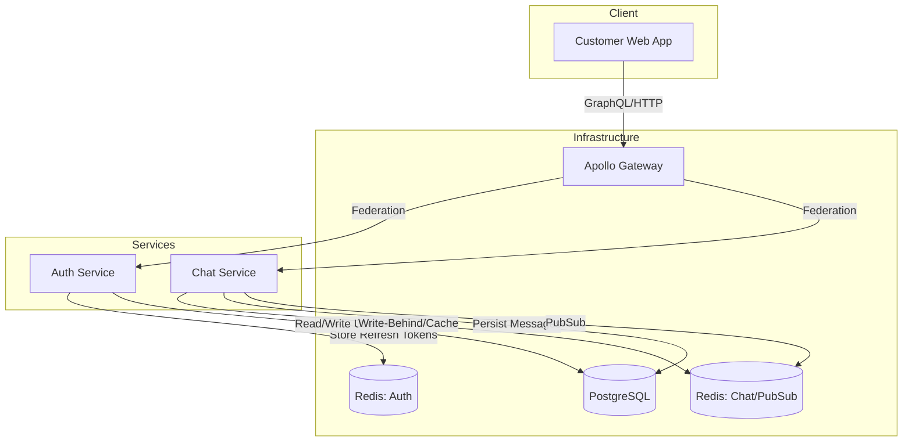

<p align="center">
  <a href="http://nestjs.com/" target="blank"></a>
  <h1 align="center">CRM Healthcare Chat System</h1>
</p>

## 📋 Description

A robust, scalable, and secure real-time chat application designed for healthcare contexts. This system features a Microservices architecture using **NestJS**, **GraphQL Federation** (Apollo Gateway), and **Next.js** for the frontend. It is built to handle high concurrency with reliability mechanisms including Dead Letter Queues (DLQ), Write-Behind patterns, and Redis caching.

Key capabilities:
- **Real-time Messaging**: Powered by GraphQL Subscriptions (via Redis PubSub).
- **Secure Authentication**: JWT-based auth with Access/Refresh token rotation and secure session management.
- **Reliability**: "Rescue Job" to recover stuck messages and a DLQ for failed operations.
- **Scalability**: Decoupled services, Redis caching, and optimized DB interactions (Bulk Inserts).

## 🛠️ Tech Stack

- **Backend**: NestJS, Apollo Gateway (GraphQL Federation), Prisma ORM
- **Frontend**: Next.js, Apollo Client, Tailwind CSS
- **Database**: PostgreSQL
- **Caching & PubSub**: Redis (Multiple instances for logical separation)
- **Containerization**: Docker, Docker Compose

## 🏗️ Architecture

The system follows a federated microservices architecture:



## 🚀 Key Approaches

### 1. Authentication & Security
- **Dual Token System**: Short-lived Access Tokens (15m) and Long-lived Refresh Tokens (7d).
- **Token Rotation**: Refresh usage invalidates the old chain, preventing replay attacks.
- **Dedicated Storage**: Refresh tokens are stored in a dedicated Redis instance (`auth-redis`) for performance and isolation.

### 2. High-Performance Chat (Write-Behind)
- **Immediate Feedback**: Messages are "sent" to the client immediately via Redis PubSub.
- **Async Persistence**: Messages are queued in Redis Lists and processed by a background worker to minimize DB write latency.
- **Rescue Job**: A Cron job (`rescuePendingMessages`) runs periodically to pick up any messages that failed to persist or got stuck, ensuring 0% data loss.

### 3. Resilience
- **Dead Letter Queue (DLQ)**: Failed message processing moves items to a DLQ for review or retry.
- **Circuit Breakers**: Implemented around DB operations to prevent cascading failures during high load.

## 🏃‍♂️ Setup & Running

Requires **Docker** and **Node.js**.

1.  **Environment Setup**
    Copy `.env.example` to `.env` (ensure variables match `docker-compose.yml`).

2.  **Start Infrastructure**
    ```bash
    docker-compose up -d
    ```
    This spins up Postgres, Redis (Auth), Redis (Chat), Auth Service, Chat Service, and Gateway.

3.  **Run Frontend**
    ```bash
    cd apps/customer-web
    npm run dev
    ```
    Access the app at `http://localhost:3000`.

4.  **Run E2E Tests**
    ```bash
    npm run test:e2e        # Chat Service Integration
    npm run test:e2e:auth   # Auth Service Integration
    ```
