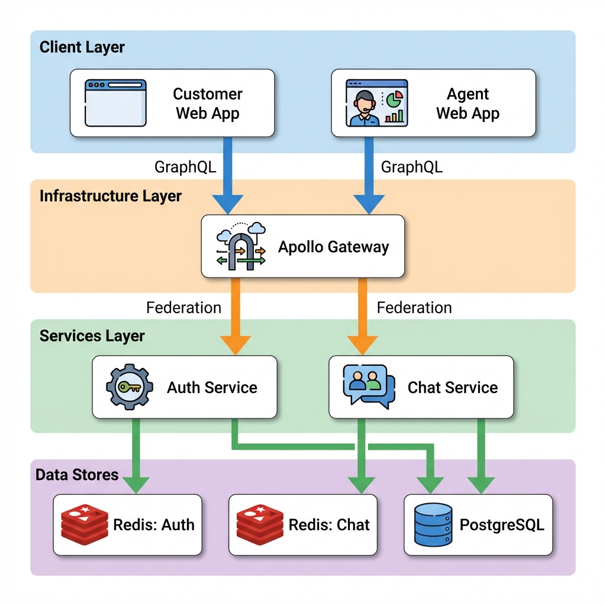

<p align="center">
  <a href="http://nestjs.com/" target="blank"></a>
  <h1 align="center">CRM Healthcare Chat System</h1>
</p>

## 📋 Description

A robust, scalable, and secure real-time chat application designed for healthcare contexts. This system features a Microservices architecture using **NestJS**, **GraphQL Federation** (Apollo Gateway), and **Next.js** for the frontend. It is built to handle high concurrency with reliability mechanisms including Dead Letter Queues (DLQ), Write-Behind patterns, and Redis caching.

Key capabilities:
- **Real-time Messaging**: Powered by GraphQL Subscriptions (via Redis PubSub).
- **Secure Authentication**: JWT-based auth with Access/Refresh token rotation and secure session management.
- **Reliability**: "Rescue Job" to recover stuck messages and a DLQ for failed operations.
- **Scalability**: Decoupled services, Redis caching, and optimized DB interactions (Bulk Inserts).

## 🛠️ Tech Stack

- **Backend**: NestJS, Apollo Gateway (GraphQL Federation), Prisma ORM
- **Frontend**: Next.js, Apollo Client, Tailwind CSS
- **Database**: PostgreSQL
- **Caching & PubSub**: Redis (Multiple instances for logical separation)
- **Containerization**: Docker, Docker Compose

## 🏗️ Architecture

The system follows a federated microservices architecture:



## 🧠 Detailed Architecture & Design Decisions

### 1. Message Processing & Write-Behind Strategy
We utilize a **Write-Behind** pattern to decouple the critical path (sending a message) from the database write latency.
- **Why**: Database writes are blocking and slow (10-100ms). Redis writes are near-instant (<1ms). By buffering in Redis queue, we ensure high throughput and low latency for the user.
- **Async vs Sync Trade-off**: 
    - *Sync (Traditional)*: High consistency but slower. A DB spike slows down every chat request.
    - *Async (Our Approach)*: "Eventual Consistency". The user sees the message immediately (Optimistic UI + Redis PubSub). The DB is updated milliseconds later. Trade-off is potential data loss if the entire cache layer crashes before persistence (mitigated by redundancy).
- **High Latency Mitigation**: If DB latency spikes, messages simply pile up in the Redis Queue/List without impacting the Sender's experience.

### 2. Reliability & Failure Mitigation
- **Queue Downtime**: If the message queue (RabbitMQ/Redis) is down, the system would fail to send. 
    - *Mitigation*: We implement a **"Rescue Job"** (Cron) that scans for messages stuck in `PENDING` state in the DB/Cache and re-queues them.
- **DB Downtime/Latency**: 
    - *Circuit Breaker*: If DB fails significantly, the consumer stops trying to write and pushes messages to a **Fallback Redis List**.
    - *Recovery*: The Rescue Job later bulk-inserts these fallback messages when the DB recovers.
- **Consumer Crashes**: We use **Manual Acknowledgement (Ack)**. If a consumer crashes while processing a message, the message is not Ack'd. The broker will redeliver it to another consumer instance.

### 3. Dead Letter Queue (DLQ)
- **Functionality**: If a message fails processing repeatedly (e.g., malformed data, permanent DB error) after 3 retries, it is moved to `chat_dlq`.
- **Monitoring**: The Ops team monitors DLQ depth via dashboards (e.g., Grafana/CloudWatch).
- **Resolution**:
    - *Automated*: The Rescue Job periodically attempts to "Redrive" DLQ messages.
    - *Manual*: Engineers can inspect the DLQ payload to debug schema issues.

### 4. Ordering & Scalability
-   **Message Ordering**: We utilize a combination of Client-generated UUIDs and `createdAt` timestamps.
    -   *Strategy*: Since strict FIFO queues can bottleneck throughput at scale (10x bursts), we allow minimal out-of-order processing (milliseconds). The Frontend (Client) is responsible for sorting messages by `createdAt` to ensure correct visual order.
-   **Scaling**: The Redis List acts as a buffer. Consumers process messages at their maximum sustainable rate.

### 5. Duplicate Message Prevention (Idempotency)
To handle network retries without creating ghost messages:
-   **Mechanism**: Clients generate a unique `deduplicationId` (UUID) for each message.
-   **Check**: The backend checks if this ID exists in Redis before processing.
    -   *Hit*: Returns the existing message immediately (cached).
    -   *Miss*: Processes the message and caches the result for 10 minutes.

### 6. Retry & Failure Handling
-   **Rescue Job**: A background Cron Job (`rescuePendingMessages`) periodically scans Redis for messages that failed to move to Postgres. It bulk-inserts them to ensure no data loss.
-   **Dead Letter Queue (DLQ)**: If a message fails processing 3 times (e.g., malformed data), it is moved to a DLQ (`chat_dlq`) for manual inspection, preventing queue blockage.
-   **Circuit Breaker**: If the Database is unreachable, the Rescue Job pauses execution to prevent cascading failures.

### 7. Operational Access Control (Small Team)
For a constrained team size, we enforce strict ease-of-management and security defaults:
- **No Direct Prod DB Access**: Write access is restricted to CI/CD pipelines and Migration Scripts. Live interaction is via Read-Only replicas or Admin Dashboards.
- **Secrets Management**: All sensitive keys (DB_URL, JWT_SECRET) are injected via Environment Variables (e.g., AWS Secrets Manager), never committed to code.
- **Deployment**: Fully automated via Docker/K8s manifests. No manual SSH allowed for deployment tasks.

## 🏃‍♂️ Setup & Running

Requires **Docker** and **Node.js**.

1.  **Environment Setup**
    Copy `.env.example` to `.env` (ensure variables match `docker-compose.yml`).

2.  **Start Infrastructure**
    ```bash
    docker-compose up -d
    ```
    This spins up Postgres, Redis (Auth), Redis (Chat), Auth Service, Chat Service, and Gateway.

3.  **Run Frontend**
    ```bash
    cd apps/customer-web
    npm run dev
    ```
    Access the app at `http://localhost:3000`.

4.  **Run E2E Tests**
    ```bash
    npm run test:e2e        # Chat Service Integration
    npm run test:e2e:auth   # Auth Service Integration
    ```
